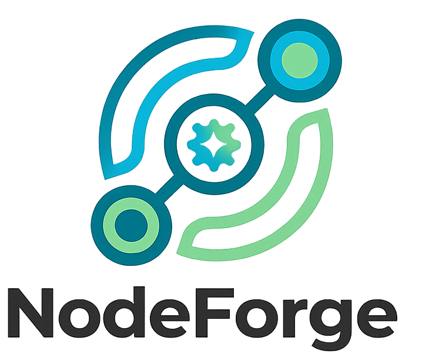

# NodeForge Landing Page



NodeForge is an intuitive, node-based machine learning platform designed to make AI accessible, visual, and highly intuitive for beginners. This repository contains the source code for the **NodeForge Landing Page**, a highly polished, responsive, and performance-optimized marketing site built to showcase the platform's features.

## 🚀 Live Demo
*(Insert your live deployment URL here once deployed)*

## ✨ Key Features & Sections
- **Dynamic Hero Carousel**: An immersive image carousel showcasing real platform screenshots, built with Embla Carousel.
- **Story-Driven Feature Breakdown**: A scrollable journey highlighting the core platform stages:
  - *The Prologue: Learning Center*
  - *The Setup: Dataset Preparation*
  - *The Action: Node-Based Canvas*
  - *The Climax: Model Comparison*
- **Cross-Device Mockup Experiences**: Realistic Safari and iPhone device mockups displaying high-quality MP4 videos of the platform in action, powered by Magic UI components.
- **Animated Micro-Interactions**: Hover states, animated lists, and fluid transitions implemented using Framer Motion.
- **Responsive Competitor Comparison**: A structured, detailed feature matrix comparing NodeForge against enterprise alternatives (SageMaker, Vertex AI) that dynamically adapts to mobile screens.
- **Comprehensive Footer**: Card-based footer layout containing quick links to the source repository, LinkedIn, creator bio, and live platform deployment.

## ⚡ Performance Improvements
This landing page was built with a heavy focus on speed, fluidity, and user experience:
- **Lazy Loaded Media**: Custom `<LazyVideo />` components ensure that the high-quality `.mp4` feature showcases only load when they enter the viewport, drastically reducing initial payload and Time to Interactive (TTI).
- **WebP & Modern Formats**: Image assets utilize the `.webp` format for superior compression without quality loss.
- **Responsive Asset Sizing**: The `ComparisonTable` leverages CSS Grid and Tailwind flex-box constraints to intelligently strip non-critical text sub-headers on mobile devices, preventing horizontal scrolling and layout shifts.
- **Optimized Fonts**: Uses `next/font/google` (`Geist` and `Geist_Mono`) to load typography at build time, eliminating layout shift and external network requests on load.
- **Tailwind CSS v4**: Utilizes the latest Tailwind rendering engine for minimal CSS bundle sizes.

## 📱 Device Mockups Used
To accurately simulate the platform experience across different environments, this site utilizes custom device frame wrappers:
- **Desktop (Safari Mockup)**: Displays the node-based canvas, model training, and evaluation flows in a realistic macOS Safari window container with dynamic drop-shadows.
- **Mobile (iPhone Mockup)**: Showcases the optimized, on-the-go "Learning Center" experience confined perfectly within a modern iOS bezel wrapper.
- Both mockups use `object-cover` video playback to ensure crisp rendering across all screen densities (retina/4K).

## 🛠️ Technology Stack
- **Framework**: [Next.js 15 (App Router)](https://nextjs.org/)
- **Language**: TypeScript
- **Styling**: [Tailwind CSS (v4)](https://tailwindcss.com/)
- **UI Components**: 
  - [shadcn/ui](https://ui.shadcn.com/) (Cards, Badges, Tooltips)
  - [Magic UI](https://magicui.design/) (Animated Lists, Safari/iPhone Mockups)
- **Animations**: [Framer Motion](https://www.framer.com/motion/)
- **Icons**: [Lucide React](https://lucide.dev/) & React Icons

## 💻 Getting Started

First, clone the repository and install dependencies:

```bash
git clone https://github.com/Periya-Samy-01/Auto_ML_Platform_01.git
cd auto-ml-platform-01
npm install
# or
yarn install
# or
pnpm install
```

Run the development server:

```bash
npm run dev
# or
yarn dev
# or
pnpm dev
```

Open [http://localhost:3000](http://localhost:3000) with your browser to see the result.

## 👨‍💻 About the Creator
**Periya Samy Ganesan**
Software Engineer | AI/ML Engineer | Web Developer

Built with ❤️ to make machine learning concepts accessible to everyone.
